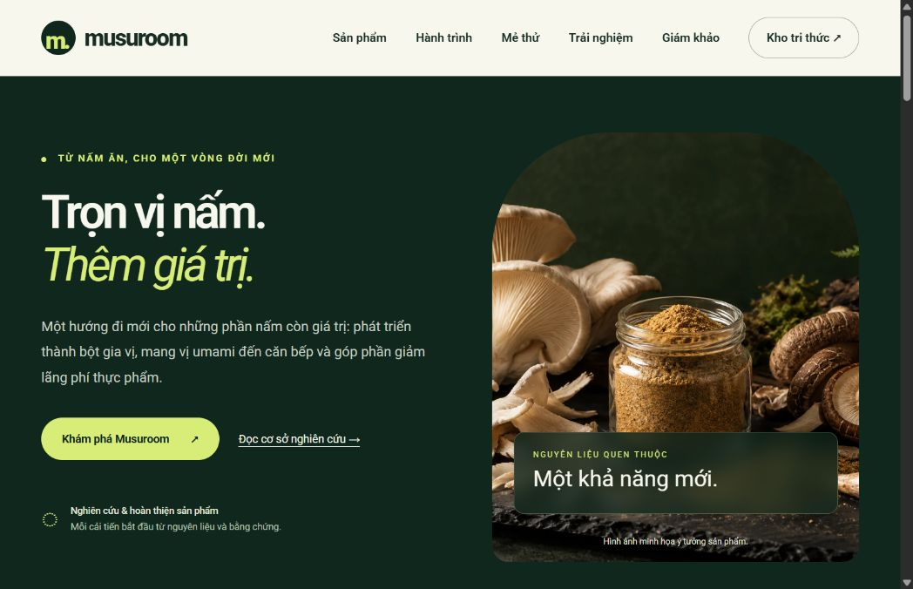

# Musuroom 1 — Website + Express + PostgreSQL/Supabase

**[Repository công khai](https://github.com/Jakcasas/musuroom)** · **[Mục lục hướng dẫn](docs/README.md)** · **[GitHub và Supabase hiện tại](docs/GITHUB_SUPABASE.md)**

[](https://github.com/Jakcasas/musuroom/actions/workflows/ci.yml)

Musuroom phát triển bột gia vị từ phụ phẩm nấm ăn để giảm lãng phí thực phẩm. Website có khảo sát cảm quan, đăng ký mẫu thử, kho tri thức có tìm kiếm và cổng giám khảo FID 2026. Toàn bộ giao diện dùng Roboto được lưu cùng mã nguồn, hỗ trợ tiếng Việt.



## Bắt đầu nhanh

Cài Node.js **24+** và pnpm **11.19.0**, rồi chạy:

```sh
git clone https://github.com/Jakcasas/musuroom.git
cd musuroom
pnpm install --frozen-lockfile
node scripts/setup.mjs
node server.mjs
```

Mở **http://127.0.0.1:8766/**. Trên Windows, sau khi cài dependencies và setup, có thể dùng `MO_MUSUROOM.cmd` để chạy nền. Setup tạo cấu hình riêng tư; server tự tạo database local và nạp kho tri thức.

**Trạng thái ngày 02.10.2026:** [website Railway](https://musuroom-web-production.up.railway.app) đã hoạt động qua HTTPS, phiên bản `1.7.0`, PostgreSQL `ok`. Supabase Singapore có 14 bảng, 6 bài tri thức và bucket hồ sơ riêng tư. QR được tạo sau khi kiểm tra hai trang đích thật. URI Atlas và key JevAI đã lưu riêng. Atlas đã nhận và được đọc kiểm chứng đủ 6 tài liệu JSON khi đồng bộ từ máy này. Worker Railway được cấu hình nhưng hiện báo `atlas_network_unavailable`; đồng bộ tự động trên cloud chưa được xác nhận. JevAI vẫn từ chối credentials/model access qua MCP chính thức. Chưa có inference thành công; giao diện dùng luật từ khóa cục bộ khi dịch vụ không đáp ứng.

Bản phát hành sản phẩm **Musuroom 1**, phiên bản mã nguồn `1.7.0`. Local chạy SQLite; cloud Railway + Supabase sử dụng PostgreSQL và private Storage. [Các cải tiến mới](docs/RELEASE_NOTES.md).

## Kho dữ liệu và hỗ trợ phân tích

**1.7.0 — Quản lý đề xuất rõ ràng hơn:** Chọn cụ thể 1–5 bài, xem trước JSON của lô, lọc trạng thái đối chiếu, mở lý do phân loại và tải đề xuất. Hủy sắp xếp khi bỏ đồng ý, tránh phản hồi đến muộn thay đổi kết quả. [4 luồng mới và hướng dẫn sử dụng](docs/JEV_WORKFLOWS.md): kiểm tra đầu vào, sắp xếp nguồn theo mức liên quan, phân loại tối đa 5 bài/lô và hàng chờ đối chiếu theo độ tin cậy. Đề xuất được lưu riêng, có kiểm tra revision và audit; nội dung nguồn không tự thay đổi. Giao thức MCP chính thức của JevAI đã được tích hợp, key vẫn chỉ lưu ở server.

Cổng ADMIN có thêm kho JSON: lọc nhóm dữ liệu, phân trang, xem từng bản ghi, tải JSON trang hiện tại và xem yêu cầu Jev trước khi gửi. Đồng bộ Atlas dùng hàng đợi có revision trong SQL, batch/upsert và xử lý thử lại. Bản JSON chỉ chọn tri thức, thống kê cảm quan tổng hợp và mẫu đo đã công bố; không chọn liên hệ đăng ký hoặc khóa truy cập.

Jev gợi ý chủ đề có kiểu và confidence để người vận hành đối chiếu nguồn. Chỉ gửi bài đã chọn khi người dùng đồng ý; enrichment tự động trong worker mặc định chưa được chọn. [Cấu hình Atlas, Jev, NDJSON và giới hạn xử lý](docs/MONGODB_JEV.md).

Bản này sửa xung đột khi gửi/reset biểu mẫu, giữ mã đợt/mẫu từ QR khi tạo phiếu mới, chuẩn hóa số điện thoại Việt Nam để tránh đăng ký trùng và cải thiện tìm kiếm nhiều từ. Mẫu đo chỉ công bố khi minh chứng COA/REPORT vẫn ở trạng thái FINAL. Database kiểm tra cấu trúc/chỉ tiêu đo; API và CLI kiểm tra thêm giá trị và phạm vi. Jev có thời hạn xử lý toàn bộ phản hồi và giới hạn 64 KiB. GitHub tự kiểm tra trên Windows và Linux.

- [Triển khai Railway + Supabase, vùng Singapore và QR](docs/DEPLOY_RAILWAY_SUPABASE.md)
- [Đối chiếu kế hoạch và phần còn cần dữ liệu](docs/PLAN_REVIEW.md)
- [Tài liệu TypeSafe lưu cục bộ và quy ước tích hợp Jev](docs/typesafe-ai/README.md)

Website dự án bột gia vị từ phụ phẩm nấm ăn, gồm kho tri thức có trích dẫn, mô hình mẻ thử, API khảo sát cảm quan, đăng ký mẫu thử và AI tùy chọn.

## Mở trên máy này

Nhấp đúp **MO_MUSUROOM.cmd** rồi mở **http://127.0.0.1:8766/**.

Kho tri thức và trợ lý: **http://127.0.0.1:8766/tri-thuc.html**. Mở mục **Hỏi trợ lý Musuroom** ở đầu thư viện. Khi chưa cấu hình dịch vụ mô hình, trợ lý trả về trích đoạn và nguồn từ database.

## Cổng giám khảo và trải nghiệm

- Giám khảo: **http://127.0.0.1:8766/giam-khao.html**. Mã truy cập riêng có thời hạn, cookie HttpOnly, phân quyền và CSRF.
- Khảo sát và đăng ký: **http://127.0.0.1:8766/trai-nghiem.html**.
- Minh bạch mẫu thử: **http://127.0.0.1:8766/minh-bach.html**.
- [Hướng dẫn cấp/thu hồi mã, thêm hồ sơ và bật Jev](docs/JUDGE_PORTAL.md). Tài khoản máy này được lưu riêng trong `data/`, không nằm trong mã nguồn.

## Cài trên máy mới

Yêu cầu **Node.js 24 trở lên**, pnpm hoặc npm.

```powershell
pnpm install --frozen-lockfile
node scripts/setup.mjs
node scripts/database.mjs
node server.mjs
```

Có thể dùng `npm install` nếu không dùng pnpm, nhưng lockfile của dự án là `pnpm-lock.yaml`. Node đi kèm Codex trên máy hiện tại đã có; script Windows tự tìm nếu PATH không có Node.

Setup tạo `.env` từ `.env.example`, sinh token ngẫu nhiên và giữ giá trị `.env` đã có và bổ sung biến mới còn thiếu. Database tự tạo tại `data/musuroom.sqlite`, chạy migration và nạp 6 bài khi khởi động. Không cần cài riêng máy chủ database. `node_modules`, database, log, PID và `.env` không đưa vào Git/ZIP mã nguồn.

Chạy nền bằng nút CMD hoặc `powershell -NoProfile -ExecutionPolicy Bypass -File .\start-musuroom.ps1`. Chạy terminal bằng `node server.mjs` và dừng bằng Ctrl+C. Nếu chạy nền, tìm PID trong `server.pid` rồi kết thúc đúng tiến trình đó trong Task Manager. Sau khi sửa `.env`, dừng server cũ rồi khởi động lại. Lỗi khởi động ghi trong `server-error.log`.

## Biến môi trường

| Biến | Mặc định | Mục đích |
|---|---|---|
| HOST | 127.0.0.1 | Chỉ mở trên máy này |
| PORT | 8766 | Cổng HTTP |
| DATABASE_PATH | ./data/musuroom.sqlite | Đường dẫn SQLite tính từ thư mục dự án |
| API_WRITE_TOKEN | Setup tự sinh | Bảo vệ API đọc/lưu mẻ; giữ riêng |
| AI_PROVIDER | disabled | `disabled` hoặc `openrouter` |
| OPENROUTER_API_KEY | Trống | Key provider, chỉ lưu phía server |
| AI_MODEL | Trống | Mã model cụ thể trong tài khoản OpenRouter |
| AI_TIMEOUT_MS | 20000 | Thời gian chờ AI, 1.000–60.000 ms |
| AI_MAX_TOKENS | 700 | Giới hạn output, 100–2.000 tokens |
| AI_CONTEXT_MAX_CHARS | 12000 | Giới hạn JSON tài liệu gửi cho mô hình, 3.000–24.000 ký tự; không gồm câu hỏi/chỉ dẫn |
| AI_MAX_CONCURRENT | 2 | Yêu cầu OpenRouter đồng thời dùng chung cho hỏi đáp và cảm quan, 1–4 |
| AI_COOLDOWN_MS | 30000 | Tạm ngừng gọi provider sau lỗi, 0–120.000 ms |
| CHAT_REQUESTS_PER_MINUTE | 10 | Số câu hỏi/phút cho mỗi IP |
| INSIGHTS_REQUESTS_PER_MINUTE | 10 | Số yêu cầu nhận xét/phút cho mỗi IP đã qua xác thực, 1–60 |

Các biến môi trường của tiến trình có ưu tiên hơn `.env`.

## API cảm quan và mẫu thử

- `POST /api/v1/sensory/submit`: gửi phiếu Hedonic 1–9 theo đợt và mã mẫu.
- `GET /api/v1/sensory/analytics`: Mean, median, độ lệch chuẩn mẫu, phân bố điểm và dữ liệu radar. Cần phiên giám khảo/quản trị hoặc bearer token, và bộ lọc đợt/mẫu.
- `POST /api/v1/sensory/export`: xuất CSV phiếu thô, cần phiên giám khảo/quản trị hoặc bearer token.
- `POST /api/v1/sensory/insights`: nhận xét số liệu tổng hợp; AI tùy chọn, cần phiên giám khảo/quản trị hoặc bearer token.
- `POST /api/v1/leads/register`: đăng ký quan tâm nhận mẫu thử, yêu cầu đồng ý lưu thông tin.
- `/api/v1/admin/leads`: danh sách/cập nhật/xóa đăng ký, cần quyền ADMIN hoặc bearer token.

Body, các giá trị hợp lệ, thuật toán và ví dụ request nằm trong [tài liệu API](docs/API.md). Form khảo sát và đăng ký đã tích hợp ở `trai-nghiem.html`. Dashboard bảo vệ bằng đăng nhập ở `giam-khao.html`, có biểu đồ radar, bảng thống kê, CSV và quản lý đăng ký theo quyền.

## Trợ lý tri thức & phân tích cảm quan

Musuroom hỗ trợ tra cứu có nguồn và diễn giải thống kê cảm quan. Mặc định, hệ thống hoạt động bằng kho tri thức và thuật toán thống kê; có thể kết nối OpenRouter để bổ sung câu trả lời bằng ngôn ngữ tự nhiên.

### Thiết lập kết nối

1. Tạo key trong [tài khoản OpenRouter](https://openrouter.ai/settings/keys), chọn mã model từ [danh mục chính thức](https://openrouter.ai/models) và kiểm tra quyền sử dụng, hạn mức, chi phí của tài khoản.
2. Cập nhật `.env` ở thư mục gốc dự án theo mẫu dưới đây. Thay cả hai giá trị `YOUR_...` bằng thông tin thật trước khi chạy:

   ```dotenv
   AI_PROVIDER=openrouter
   OPENROUTER_API_KEY=YOUR_OPENROUTER_API_KEY
   AI_MODEL=YOUR_OPENROUTER_MODEL_ID
   AI_TIMEOUT_MS=20000
   AI_MAX_TOKENS=700
   AI_CONTEXT_MAX_CHARS=12000
   AI_MAX_CONCURRENT=2
   AI_COOLDOWN_MS=30000
   INSIGHTS_REQUESTS_PER_MINUTE=10
   ```

3. Dừng server đang chạy rồi khởi động lại theo mục **Cài trên máy mới**. Khi triển khai cloud, đặt các biến trong cấu hình riêng tư của dịch vụ Railway rồi redeploy; `.env` trên máy không tự đồng bộ lên cloud.
4. Mở `tri-thuc.html` → **Hỏi trợ lý Musuroom**, kiểm tra thông báo kết nối và thử một câu hỏi như “Umami của nấm đến từ đâu?”. Cổng giám khảo cung cấp nhận xét cảm quan sau khi đăng nhập và chọn đợt/mã mẫu.

Key chỉ dùng ở server. Giữ `.env` ngoài Git, ZIP công khai và frontend; không gửi key vào chat. Để trở về chế độ tra cứu và thống kê tại server, đặt `AI_PROVIDER=disabled` rồi khởi động lại. Tham khảo [hướng dẫn API OpenRouter](https://openrouter.ai/docs/quickstart).

### Phạm vi hỗ trợ

| Chức năng | Dữ liệu gửi đến mô hình | Kết quả và cách đối chiếu |
|---|---|---|
| Hỏi đáp kho tri thức | Câu hỏi hiện tại và nội dung tối đa **3 bài liên quan**: mã nguồn trích dẫn, tiêu đề, tóm tắt, nội dung và giới hạn áp dụng; phần tài liệu được giới hạn dung lượng và đánh dấu nếu rút gọn | Câu trả lời kèm nguồn để mở và đọc lại. Không tìm kiếm Internet tự động. |
| Nhận xét cảm quan | Khi có ít nhất **3 phiếu hợp lệ trong cùng đợt/mã mẫu**: số phiếu, tên tiêu chí, trung bình và độ lệch chuẩn mẫu | Nhận xét mô tả ngắn. Trường `basis` luôn kèm số phiếu, đợt/mã mẫu và Mean/SD để đối chiếu. API yêu cầu quyền giám khảo/quản trị hoặc bearer token. |

Các chỉ số Mean, median, độ lệch chuẩn, phân bố điểm và radar được tính bằng thuật toán từ phiếu hợp lệ, độc lập với mô hình. Mốc 3 phiếu là điều kiện sử dụng chức năng diễn giải, không chứng minh cỡ mẫu đủ để kiểm định thống kê. Nhận xét không xác nhận nguyên nhân, an toàn thực phẩm, dinh dưỡng hay khả năng thương mại của sản phẩm.

API thống kê và nhận xét đọc phân bố tổng hợp ngay tại database: tối đa **49 dòng** cho mỗi đợt/mã mẫu, thay vì tải toàn bộ phiếu. SQLite dùng truy vấn tổng hợp; Supabase dùng hàm riêng tư `musuroom_sensory_distribution`. Mean/median/SD được tính từ phân bố 1–9. API xuất CSV vẫn đọc phiếu thô theo phân quyền.

### Nguồn, dữ liệu và chế độ dự phòng

- Giao diện hỏi đáp thông báo việc gửi câu hỏi và tài liệu liên quan đến OpenRouter khi kết nối được cấu hình. Người hỏi cần tránh nhập dữ liệu cá nhân hoặc nội dung riêng tư vào câu hỏi.
- Musuroom không lưu lịch sử hỏi đáp vào database. Luồng nhận xét cảm quan không gửi phiếu thô, góp ý tự do, tên hoặc thông tin liên hệ; chỉ gửi số liệu tổng hợp nêu trên. Việc xử lý dữ liệu tại dịch vụ bên ngoài phụ thuộc chính sách và cấu hình của dịch vụ đó.
- Hỏi đáp kiểm tra có mã trích dẫn và các mã được dùng thuộc tập nguồn đã truy xuất. Đây là kiểm tra mã nguồn trích dẫn; người đọc vẫn cần đối chiếu từng nhận định với tài liệu gốc.
- Khi dịch vụ lỗi, hết thời gian chờ, đang bận hoặc phản hồi không hợp lệ, hệ thống trả trích đoạn có nguồn (`mode=retrieval`) hoặc nhận xét thống kê (`mode=descriptive`). Không có bài phù hợp thì thông báo thiếu nội dung; dưới 3 phiếu thì chỉ trả thống kê mô tả.
- Hỏi đáp và nhận xét dùng chung giới hạn đồng thời trong mỗi tiến trình server. Sau lỗi provider, hệ thống tạm dùng kết quả dự phòng trong thời gian `AI_COOLDOWN_MS`; nếu provider yêu cầu chờ lâu hơn qua `Retry-After`, thời gian chờ có thể tăng tối đa 120 giây. Không tự gửi lại request. Đây là giới hạn tần suất/dung lượng, không phải trần chi phí tiền tệ; đặt hạn mức tài khoản tại OpenRouter để kiểm soát ngân sách.
- Thời gian chờ bao gồm việc nhận và đọc phản hồi. Server chặn redirect, giới hạn phản hồi provider ở 64 KiB và không sử dụng câu trả lời bị cắt do hết token hoặc bị provider từ chối. Không lưu cache câu hỏi/câu trả lời.

### Kiểm tra vận hành

| Tình huống | Cách xử lý |
|---|---|
| Server báo thiếu `OPENROUTER_API_KEY` hoặc `AI_MODEL` | Điền đủ hai biến khi dùng `openrouter`, hoặc chọn `disabled` để chạy chế độ mặc định. |
| Giao diện vẫn hiển thị chế độ tra cứu | Kiểm tra đã dừng server cũ và khởi động lại; biến của tiến trình có ưu tiên hơn `.env`. |
| Kết quả có `reason=provider_unavailable` | Kiểm tra kết nối mạng, key, mã model, quyền sử dụng và hạn mức OpenRouter. |
| Kết quả có `invalid_citations`, `invalid_response` hoặc `ai_busy` | Đọc kết quả dự phòng và nguồn kèm theo; có thể thử lại sau. |
| Kết quả có `provider_cooldown` | Dùng kết quả dự phòng; `retry_after` cho biết số giây có thể chờ trước khi thử lại. |
| HTTP 429 | Chờ theo header `Retry-After`; kiểm tra hạn mức hỏi đáp hoặc nhận xét theo IP. |
| Nhận xét có `too_few_responses` hoặc `no_responses` | Kiểm tra đúng đợt/mã mẫu và số phiếu hợp lệ. |

**Trạng thái kiểm chứng:** luồng OpenRouter đã được kiểm tra bằng mock, gồm phản hồi hợp lệ, giới hạn đồng thời, thời gian chờ, phản hồi quá lớn và chế độ dự phòng; chưa xác minh bằng lời gọi dịch vụ thật vì chưa cấu hình key/model. Migration tổng hợp đã áp dụng lên Supabase và kiểm tra quyền gọi; các chỉ số được kiểm thử trên SQLite/PostgreSQL. `aiEnabled` chỉ phản ánh cấu hình, không chứng minh dịch vụ đang đáp ứng. Chi tiết request, phân quyền và các trường phản hồi nằm trong [tài liệu API](docs/API.md). Tích hợp phân loại góp ý bằng Jev được hướng dẫn riêng trong [cổng giám khảo](docs/JUDGE_PORTAL.md).

## Tài liệu dự án

- [Kiến trúc, ERD và database](docs/ARCHITECTURE.md)
- [REST API và ví dụ request](docs/API.md)
- [Migration SQL](backend/db/migrations/002_sensory_samples.sql)
- [Migration tài khoản, phiên và hồ sơ](backend/db/migrations/003_judge_portal.sql)
- [Vận hành cổng giám khảo, cấp mã và Jev](docs/JUDGE_PORTAL.md)
- [Mẫu môi trường](.env.example)
- [Ghi chú bản 1.7.0](docs/RELEASE_NOTES.md)

Repository công khai dùng nhánh `main`. Checkout trên máy này dùng nhánh `codex/musuroom-backend`, theo dõi `origin/main`. Các thay đổi mới nên được thực hiện trên nhánh riêng rồi review trước khi đưa vào `main`.

## Mẫu đo và số liệu công bố

`GET /api/v1/project/overview`, `/api/v1/product/batches`, `/api/v1/product/nutrition` đọc nội dung công bố. `POST /api/v1/admin/product-samples` cần ADMIN/CSRF, ít nhất một chỉ tiêu đo hợp lệ và minh chứng COA/REPORT ở trạng thái FINAL. Có thể nhập JSON dữ liệu đo thực bằng `node scripts/add-sample.mjs data/ACTUAL_SAMPLE.json`; mặc định PRIVATE. Nếu minh chứng bị chuyển về DRAFT hoặc đổi sang loại khác, API công khai ngừng hiển thị mẫu liên quan. FINAL là nhãn do người vận hành chọn, không tự xác nhận chất lượng của minh chứng. Schema chỉ tiêu/phạm vi nằm trong `backend/routes/project.mjs`. Dinh dưỡng trên 100 g, không tự tạo đối chứng. Nếu chưa có hồ sơ đo, trang minh bạch hiển thị trạng thái chưa công bố.

## Kiểm tra

```powershell
pnpm check
pnpm test
pnpm audit --prod --audit-level=moderate
```

`pnpm check` kiểm tra cú pháp JavaScript và đường dẫn tài nguyên HTML. `pnpm test` hiện có **50 bài kiểm thử**, bổ sung queue/revision/lease, quyền ADMIN cho JSON, projection không chứa liên hệ, Jev tri thức, kiểm tra cloud và QR theo phiên bản. Database kiểm thử dùng bộ nhớ hoặc thư mục tạm; provider/Mongo writer dùng mock. Đăng nhập, phân quyền, Storage và health đã được kiểm tra thêm trên cloud thật. GitHub Actions chạy cùng bộ kiểm tra trên Windows/Linux; audit dependencies sản xuất chạy trên Linux.

Trước khi công bố từ máy người vận hành, chạy `node scripts/check-publish.mjs` sau commit để kiểm tra lịch sử Git đối chiếu bí mật cục bộ. Script không in giá trị bí mật. Tạo ZIP mã nguồn bằng `git archive` từ commit đã kiểm tra để chỉ đóng gói tệp được theo dõi.

## Phạm vi nội dung

4 nguồn bên ngoài và 2 ghi chú phương pháp của Musuroom; không tự cập nhật từ Internet. Website chính thức của dự án không đồng nghĩa với sản phẩm thương mại đã kiểm nghiệm. Ảnh hero do AI tạo để minh họa ý tưởng. Mô hình tính bột nền là giả định trước phối trộn, không xác nhận an toàn hoặc mức giảm lãng phí thực tế.

Frontend có bản dữ liệu dự phòng để đọc khi API không sẵn sàng. Cập nhật bản ghi đã seed cần migration dữ liệu; seed không ghi đè dữ liệu có sẵn. Font Roboto nằm trong `dist/assets/fonts/` với giấy phép OFL và được tải từ chính server. Liên kết tài liệu bên ngoài cần Internet.

## Trạng thái đồng bộ trên Railway

Worker trên Railway hiện trả `atlas_network_unavailable`, dù đồng bộ từ máy này và đọc lại Atlas đã thành công. Cần kiểm tra Atlas Network Access và DNS/kết nối từ Railway trước khi xác nhận đồng bộ tự động trên cloud. Dữ liệu khảo sát vẫn lưu vào Supabase; có thể chạy `data:sync` từ máy đã được Atlas cho phép.
