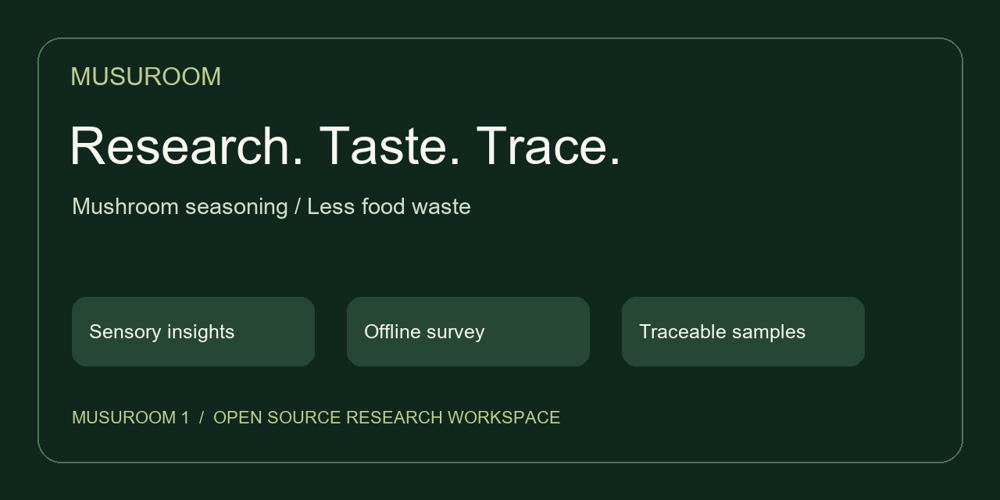
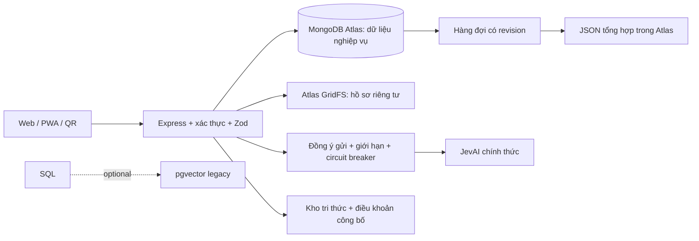

# Musuroom 1 · Research workspace

[](https://github.com/Jakcasas/musuroom/actions/workflows/ci.yml)


[](LICENSE)



Website nghiên cứu bột gia vị từ phụ phẩm nấm ăn: khảo sát cảm quan, kho tri thức có nguồn, hồ sơ mẫu và cổng giám khảo. Giao diện tiếng Việt, font Roboto lưu cùng ứng dụng.

**[Mở website](https://musuroom-web-production.up.railway.app)** · **[Khảo sát](https://musuroom-web-production.up.railway.app/trai-nghiem.html)** · **[Cổng giám khảo](https://musuroom-web-production.up.railway.app/giam-khao.html)** · **[Hướng dẫn](docs/README.md)**

Triển khai từ `main` vào **Musuroom 1 → musuroom-web → production**, cổng `8080`, healthcheck `/healthz`. Hai thông báo Railway mang tên `perpetual-tranquility` và `mcp.musuroom.com` trên commit cũ thuộc cùng một dịch vụ tạo thêm thiếu biến production; dịch vụ rỗng đã được gỡ. [Đích triển khai và cách xử lý lỗi](docs/RAILWAY_RECOVERY.md).

## Bản 1.11.0 — MongoDB Atlas cho dữ liệu ứng dụng

Railway dùng `DATABASE_PROVIDER=mongodb` và `STORAGE_PROVIDER=mongodb`. Khảo sát, đăng ký mẫu, tài khoản/phiên đăng nhập, hồ sơ nghiên cứu, điểm và hàng chờ đối chiếu được lưu trực tiếp thành BSON/JSON trong Atlas. Tệp hồ sơ riêng tư lưu bằng GridFS. Dữ liệu không phụ thuộc ổ đĩa tạm của container.

Unique index chống gửi trùng; transaction giữ phiếu khảo sát và hàng đợi đồng bộ nhất quán. Chấm điểm kiểm tra phiên bản hồ sơ trong transaction. Schema kiểm tra kiểu dữ liệu; các truy vấn lọc và phân trang có index. API vector 384 chiều chạy được trên MongoDB, lọc cùng model và phiên bản nguồn; đây là cosine search chính xác, chưa phải Atlas Vector Search có index ANN cho hàng triệu tài liệu.

PostgreSQL/Supabase được giữ trong công cụ kiểm thử và tương thích dữ liệu cũ; gói `pg` nằm trong devDependencies, không được cài trong image production. SQLite chỉ dành cho phát triển trên máy. [Cấu hình, kiểm thử và quy trình chuyển đổi](docs/MONGODB_PRIMARY.md).

## Vận hành từ bản 1.8.5

Vận hành Railway ở Singapore với một replica, healthcheck database `/healthz`, overlap 10 giây và draining 35 giây. Backend dừng nhận yêu cầu mới, dừng worker một lần và chờ yêu cầu đang chạy trước khi đóng database; deadline 30 giây. Health trả 503 khi database chưa sẵn sàng. Watch paths chỉ build lại khi tài sản chạy ứng dụng thay đổi. [Cấu hình và vận hành Railway](docs/RAILWAY_OPERATIONS.md).

### Các luồng của bản 1.8.4

Bốn luồng Jev gồm kiểm tra đầu vào, sắp xếp nguồn, phân loại 1–5 bài/lô và lưu đề xuất để đối chiếu. Bản này bổ sung nhận diện bí mật tiếng Việt/ký tự ẩn, giới hạn request sắp xếp nguồn 18 KB và đưa kết quả có hai nhãn gần nhau vào hàng chờ. Giao diện nêu rõ số đề xuất từ Jev và từ luật cục bộ; lý do cần xem lại được lưu cùng đề xuất trong Atlas. [Chi tiết các luồng](docs/JEV_WORKFLOWS.md).

Hỗ trợ mã do người vận hành chọn cho một tài khoản Giám khảo mặc định, lưu dưới dạng scrypt trong database. Đổi mã thu hồi phiên cũ, giữ nguyên quyền và thời hạn; đăng nhập kiểm tra lại trạng thái tài khoản trước khi tạo phiên. [Quản lý mã truy cập](docs/JUDGE_PORTAL.md).

Hồ sơ nghiên cứu chọn minh chứng trực tiếp từ tài liệu đã tải lên. Giám khảo đọc thông tin mẫu trước khi chấm; bảng tổng hợp tách điểm của phiên bản hiện tại và phiếu cần đối chiếu lại. API chặn lưu nếu hồ sơ thay đổi, database kiểm tra thang điểm và tổng theo trọng số. [Hướng dẫn vận hành](docs/UPGRADE_2026.md).

Jev MCP đọc đúng cấu trúc kết quả chính thức; cổng giám khảo hiển thị trạng thái dịch vụ, lý do dùng dự phòng và nút kiểm tra câu minh họa dành cho ADMIN. `pnpm jev:check --cloud` thử cấu hình riêng tư. `pnpm jev:diagnose --cloud` tách kiểm tra kết nối, danh sách công cụ và quyền suy luận. `pnpm mcp:install-jev` thêm server Jev vào Codex mà không lưu key trong config. [Cài MCP và xử lý lỗi key/model](docs/JEV_MCP_SETUP.md). Quyền suy luận của key hiện lưu vẫn bị Jev từ chối trong lần thử ngày 07.10.2026.

- Hồ sơ hũ mẫu, mã lô, nguồn nguyên liệu và QR giữ nguyên khi cập nhật thông tin.
- Chấm điểm theo bộ tiêu chí dự thảo, trọng số tổng 100%, xử lý xung đột phiên bản.
- Radar 5 trục tương tác; báo cáo A4 qua nút **In báo cáo / Lưu PDF**.
- Khảo sát ngoại tuyến sau lần mở online đầu tiên; người thử chọn lưu phiếu và chủ động gửi lại, giữ khóa chống gửi trùng.
- Điều khoản có phiên bản, trích dẫn và giới hạn áp dụng; nguồn công bố tham gia kho tri thức. API vector 384 chiều dành cho ADMIN.
- Zod kiểm tra đầu vào; circuit breaker giảm gọi Jev khi lỗi; API ADMIN chẩn đoán Atlas từ máy chủ.

**Dữ liệu cần bổ sung:** chưa có hồ sơ TCVN, lô/hũ thật hoặc bộ tiêu chí FID chính thức. Không nạp mẫu minh họa vào production. Chức năng vector cần embedding từ cùng model; chưa tự tạo embedding. Jev/Atlas cloud phải được kiểm tra riêng, không suy ra đang hoạt động chỉ vì đã lưu key. Xem [đối chiếu toàn bộ upgrade.docx và giới hạn](docs/UPGRADE_2026.md).

## Chạy trên máy

```sh
git clone https://github.com/Jakcasas/musuroom.git
cd musuroom
pnpm install --frozen-lockfile
pnpm setup
pnpm start
```

Yêu cầu Node.js 24+, pnpm 11.19.0. Mở [localhost:8766](http://127.0.0.1:8766/). Windows có thể dùng `MO_MUSUROOM.cmd` sau khi cài đặt. Setup giữ cấu hình đang có, sinh token riêng tư và bổ sung biến thiếu. SQLite được tạo tại `data/musuroom.sqlite`.

Docker local: `docker compose up --build -d`; chỉ công bố cổng trên 127.0.0.1, dữ liệu ở named volume. `CONTAINER_LOCAL=true` chỉ dùng trong Compose để lắng nghe bên trong container. Máy phát triển hiện chưa có Docker để kiểm chứng build/run.

## Kiến trúc



| Phân hệ | Giao diện | Hướng dẫn |
|---|---|---|
| Khảo sát & mẫu thử | `trai-nghiem.html` | [API và thang Hedonic 1–9](docs/API.md) |
| Nguồn & trợ lý | `tri-thuc.html`, `dieu-khoan.html` | [Trợ lý tri thức & phân tích cảm quan](docs/ASSISTANT.md) |
| Hồ sơ, radar, PDF, đăng ký | `giam-khao.html` | [Phân quyền & cấp mã](docs/JUDGE_PORTAL.md) |
| Hũ mẫu, bộ tiêu chí, điểm | `nghien-cuu.html` | [Vận hành nghiên cứu](docs/UPGRADE_2026.md) |
| Truy xuất từng hũ | `truy-xuat.html?sample=TOKEN` | QR chỉ mở hồ sơ được công bố |
| Thuyết trình | `pitch.html` | 5 phần, bàn phím, toàn màn hình |
| Dữ liệu & Jev | Không gian dữ liệu ADMIN | [Luồng Jev](docs/JEV_WORKFLOWS.md), [Atlas](docs/MONGODB_JEV.md) |

## Cấu hình môi trường

Sao chép bằng `pnpm setup`; nguồn mẫu là [.env.example](.env.example). Biến tiến trình có ưu tiên hơn `.env`. Railway nhận biến riêng tư trong dịch vụ; không tự lấy `.env` local. Giá trị trống bên dưới nghĩa là chưa cấu hình.

| Biến | Mặc định | Mục đích |
|---|---|---|
| `HOST` | `127.0.0.1` | Địa chỉ lắng nghe; cloud dùng 0.0.0.0 |
| `PORT` | `8766` | Cổng HTTP |
| `NODE_ENV` | `development` | development hoặc production |
| `DATABASE_PATH` | `./data/musuroom.sqlite` | Tệp SQLite local |
| `DATABASE_PROVIDER` | `sqlite` khi local | Railway dùng `mongodb`; postgres chỉ dành cho công cụ legacy |
| `DATABASE_URL` | `` | URL PostgreSQL riêng tư nếu dùng legacy |
| `DATABASE_CA_CERT` | `` | CA PostgreSQL nếu dùng legacy |
| `PUBLIC_ORIGIN` | `` | HTTPS gốc của ứng dụng dùng tạo QR |
| `STORAGE_PROVIDER` | `local` | local hoặc supabase |
| `SUPABASE_URL` | `` | URL project Supabase |
| `SUPABASE_SERVICE_ROLE_KEY` | `` | Khóa server; không đưa vào frontend |
| `SUPABASE_STORAGE_BUCKET` | `musuroom-dossier` | Bucket hồ sơ riêng tư |
| `API_WRITE_TOKEN` | `` | Token local do setup sinh; cloud dùng phiên đăng nhập |
| `AI_PROVIDER` | `disabled` | disabled hoặc openrouter; độc lập với Jev |
| `OPENROUTER_API_KEY` | `` | Key server OpenRouter nếu dùng |
| `AI_MODEL` | `` | Mã model OpenRouter cụ thể |
| `AI_TIMEOUT_MS` | `20000` | Thời hạn phản hồi, ms |
| `AI_MAX_TOKENS` | `700` | Giới hạn output |
| `AI_CONTEXT_MAX_CHARS` | `12000` | Giới hạn nội dung nguồn gửi mô hình |
| `AI_MAX_CONCURRENT` | `2` | Số lời gọi OpenRouter đồng thời mỗi tiến trình |
| `AI_COOLDOWN_MS` | `30000` | Tạm nghỉ sau lỗi OpenRouter, ms |
| `CHAT_REQUESTS_PER_MINUTE` | `10` | Giới hạn hỏi đáp/IP/phút |
| `INSIGHTS_REQUESTS_PER_MINUTE` | `10` | Giới hạn nhận xét/IP/phút |
| `AUTH_SESSION_MINUTES` | `120` | Thời hạn phiên tuyệt đối, phút |
| `AUTH_IDLE_MINUTES` | `20` | Thời hạn không hoạt động, phút |
| `AUTH_LOGIN_LIMIT` | `8` | Giới hạn đăng nhập theo IP |
| `JUDGE_BOOTSTRAP_CODE` | `` | Mã giám khảo server-only để bootstrap tài khoản runtime |
| `ADMIN_BOOTSTRAP_CODE` | `` | Mã quản trị server-only để bootstrap tài khoản runtime |
| `JEV_ENABLED` | `false` | Cho phép kết nối JevAI chính thức |
| `JEV_API_KEY` | `` | Key từ www.jevai.org/agent/keys, chỉ ở server |
| `JEV_MODEL` | `typesafe-ai/jev` | Model Jev được tài khoản cho phép |
| `JEV_MIN_CONFIDENCE` | `0.65` | Ngưỡng đối chiếu đề xuất |
| `MONGO_ENABLED` | `false` | Bật worker đồng bộ Atlas |
| `MONGODB_URI` | `` | URI Atlas riêng tư |
| `MONGODB_DATABASE` | `musuroom` | Database đích Atlas |
| `MONGO_SOURCE_ID` | `musuroom-local` | Mã nguồn đồng bộ ổn định, không đổi tùy tiện |
| `MONGO_JEV_ENRICHMENT` | `false` | Đồng ý phân loại qua Jev trong worker, mặc định false |
| `MONGO_SYNC_BATCH_SIZE` | `25` | Bản ghi mỗi đợt đồng bộ |
| `MONGO_SYNC_INTERVAL_MS` | `60000` | Khoảng nghỉ worker, ms |
| `MONGO_JEV_MAX_PER_RUN` | `10` | Số yêu cầu phân loại tối đa mỗi đợt |
| `JEV_TRANSPORT` | `mcp` | mcp hoặc rest của www.jevai.org |

Không đưa `.env`, key, URI database, mã giám khảo hoặc dữ liệu cá nhân vào Git/ZIP/frontend. Atlas giữ dữ liệu nghiệp vụ và JSON projection. Tài liệu riêng tư nằm trong GridFS. Railway không dùng PostgreSQL/Supabase hoặc SQLite; mã legacy chỉ phục vụ phát triển và đối chiếu dữ liệu cũ.

## Tri thức và hỗ trợ phân tích

Luồng **JSON → JSON Schema → Atlas → Jev** có tác vụ tối đa 10.000 bản ghi, lô 5 bài, checkpoint và nhật ký quyết định. Quản trị có thể xem trước, tạo, theo dõi, dừng và tiếp tục tác vụ ngay trong cổng hồ sơ. [Hợp đồng JSON và hướng dẫn xử lý theo lô](docs/JSON_JEV_PIPELINE.md). Key/model lỗi sẽ chặn tác vụ; kết quả cục bộ được ghi đúng nguồn.

Jev sử dụng duy nhất dịch vụ **www.jevai.org**, key từ [trang quản lý key](https://www.jevai.org/agent/keys), model `typesafe-ai/jev`. Người vận hành xem dữ liệu và đồng ý trước khi gửi; mặc định worker không tự enrichment. Khi dịch vụ lỗi hoặc quyền model không hợp lệ, dùng luật từ khóa cục bộ, ghi rõ nguồn kết quả và không tạo confidence giả.

OpenRouter là kết nối hỏi đáp tùy chọn, mặc định `disabled`. Hướng dẫn đầy đủ đã tách vào [Trợ lý tri thức & phân tích cảm quan](docs/ASSISTANT.md). Điểm cảm quan và chấm thi luôn được tính bằng thuật toán; mô hình không tự sửa nguồn, chứng nhận chất lượng hoặc quyết định điểm.

## Triển khai và kiểm tra

- [Railway + Atlas + QR: các bước vận hành](docs/DEPLOY_RAILWAY_SUPABASE.md).
- [Đối chiếu lịch sử migration](docs/GITHUB_SUPABASE.md). Không sửa migration đã áp dụng; tạo migration mới rồi đối chiếu đúng version/name/SQL.
- [Nội dung nâng cấp, KPI và việc cần làm ngoài hệ thống](docs/UPGRADE_2026.md).

```sh
pnpm check
pnpm test
pnpm audit --prod --audit-level=moderate
pnpm db:check-history
```

Lệnh cuối cần cấu hình cloud riêng tư. Kiểm thử dùng database tạm và mock provider; GitHub Actions chạy Windows/Linux. `node scripts/check-publish.mjs` kiểm tra lịch sử sau commit mà không in bí mật. Đóng gói bằng `git archive`, không nén thư mục runtime.

## Đóng góp và giấy phép

[CONTRIBUTING](CONTRIBUTING.md) · [MIT](LICENSE) · [Thông báo tài nguyên bên thứ ba](NOTICE.md) · [Release notes](docs/RELEASE_NOTES.md).

Các nguồn và trích đoạn tiêu chuẩn giữ quyền của chủ sở hữu. Nội dung nghiên cứu chưa thay thế thử nghiệm sản phẩm, kiểm nghiệm hoặc hồ sơ chứng nhận. Uptime 99,9% và chất lượng AI là mục tiêu cần đo; không được coi là kết quả đã đạt.
