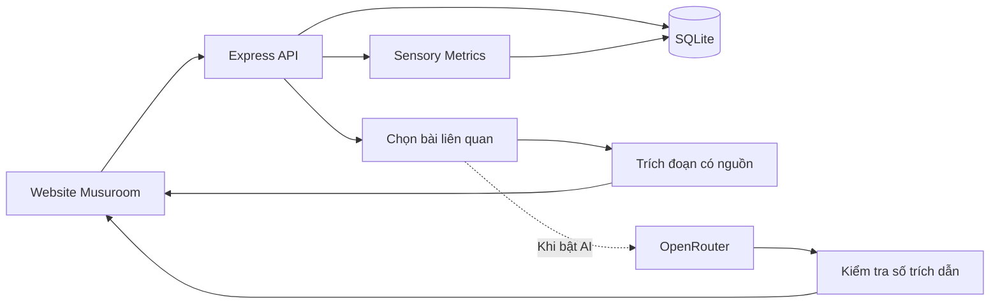
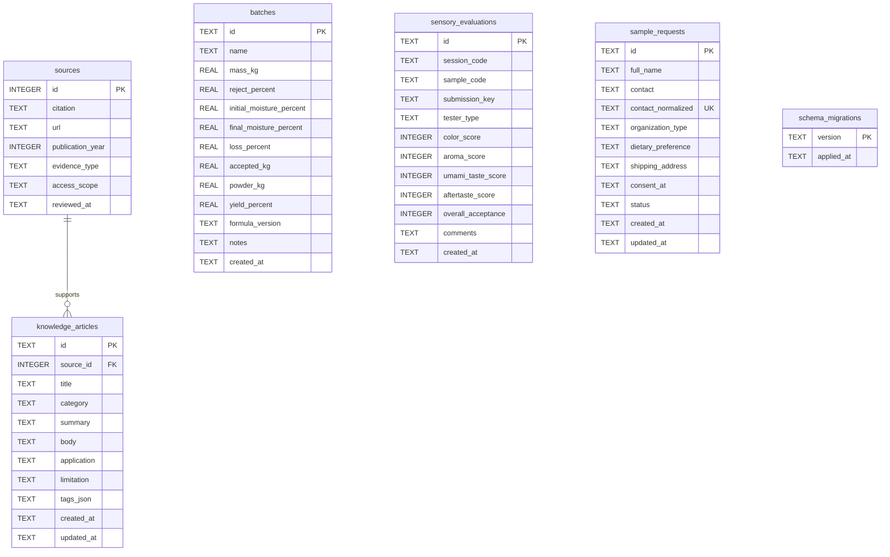

# Kiến trúc Musuroom 1.2

## Luồng ứng dụng



Frontend vẫn chạy bằng HTML/CSS/JavaScript. Kho tri thức tải dữ liệu từ `/api/knowledge`; nếu API không sẵn sàng, dùng bản dữ liệu đi kèm và hiển thị trạng thái. Tìm kiếm hiện chạy trên tập bài đã tải, chuẩn hóa tiếng Việt có/không dấu. API cũng hỗ trợ `q` và `category` để các ứng dụng khác sử dụng.

## Cấu trúc thư mục

```text
backend/
  app.mjs                  Express, middleware, REST routes
  config.mjs               Kiểm tra và ánh xạ biến môi trường
  db/database.mjs          Kết nối, migration và seed
  db/migrations/*.sql      Schema SQL có phiên bản
  repositories/            Đọc/ghi SQLite bằng prepared statement
  services/assistant.mjs   Truy xuất tài liệu và AI tùy chọn
dist/                      Website và tài nguyên static
scripts/                   Tạo .env, migrate/seed database
tests/                     Kiểm tra logic, HTTP, database và AI mock
data/                      SQLite runtime, không đưa vào Git
.env                       Cấu hình riêng, không đưa vào Git
.env.example               Mẫu cấu hình có thể chia sẻ
```

## Database



- `sources`: nguồn và phạm vi tham khảo. Năm xuất bản tách khỏi ngày đối chiếu.
- `knowledge_articles`: nội dung biên soạn, ứng dụng, giới hạn và tags JSON. Một nguồn có thể hỗ trợ nhiều bài; hiện mỗi bài gắn một nguồn.
- `batches`: mẻ tính toán lưu đầu vào và kết quả do server tính, kèm phiên bản công thức. Kết quả ước tính không phải dữ liệu kiểm nghiệm.
- `sensory_evaluations`: mỗi phiếu thuộc một `session_code` và `sample_code`. Dữ liệu này không liên kết FK với `batches`, vì mã mẫu thử cảm quan có thể khác mã mẻ tính bột. Điểm chỉ nhận giá trị nguyên 1–9. Cặp đợt/mẫu/UUID gửi lại có index duy nhất để retry an toàn.
- `sample_requests`: đăng ký quan tâm có thời điểm đồng ý lưu liên hệ, trạng thái và khóa liên hệ chuẩn hóa để tránh đăng ký trùng. Chỉ API quản trị trả thông tin cá nhân.
- `schema_migrations`: theo dõi migration đã áp dụng. Mỗi migration chạy trong transaction.

SQLite bật foreign keys, WAL và timeout 5 giây. Có index chủ đề, nguồn và ngày tạo mẻ. Khi khởi động, migration chạy trước seed. Seed dùng `INSERT OR IGNORE`, không ghi đè bài đã sửa. Thay đổi dữ liệu đã seed cần migration dữ liệu rõ ràng; chỉ sửa file seed sẽ không sửa bản ghi cũ.

Không lưu lịch sử hội thoại. Sao lưu local: dừng server rồi sao chép thư mục `data/`; giữ bản sao ngoài thư mục đang chạy. Tránh chỉ sao chép file `.sqlite` khi server đang chạy vì dữ liệu mới có thể còn trong WAL.

## Giới hạn triển khai

Bản này phục vụ một máy trên `127.0.0.1`. SQLite phù hợp quy mô hiện tại; chưa có tài khoản người dùng, quản trị bài viết, đồng bộ nhiều máy hay tìm kiếm vector. API mẻ thử dùng bearer token chung cho người vận hành, không phải hệ thống phân quyền nhiều người. Không đổi sang public hosting trước khi bổ sung xác thực, phân quyền và giới hạn sử dụng theo người dùng.

AI kho tri thức lấy tối đa 3 bài bằng đối sánh từ khóa. Server kiểm tra mã nguồn trích dẫn có thuộc các bài đã truy xuất; phép kiểm tra này không chứng minh mọi câu AI sinh ra đều đúng. Giao diện dẫn về bài gốc để đối chiếu. Khi thiếu nguồn, lỗi provider hoặc trích dẫn không hợp lệ, trả nội dung tra cứu từ thư viện. AI mock đã được kiểm tra; gọi provider thật cần API key/model hợp lệ.

AI cho thống kê cảm quan chỉ nhận số lượng phiếu, trung bình và độ lệch chuẩn theo tiêu chí, không nhận phiếu cá nhân, nhận xét hay liên hệ. Với dưới 3 phiếu hoặc AI chưa bật, server trả nhận xét mô tả. Không nên dùng AI để tuyên bố mức độ tin cậy hoặc sự khác biệt có ý nghĩa thống kê.

## Tài liệu kỹ thuật sử dụng

- [Express 5](https://expressjs.com/en/guide/migrating-5/)
- [Node.js SQLite](https://nodejs.org/download/release/latest-v24.x/docs/api/sqlite.html)
- [OpenRouter Chat Completions](https://openrouter.ai/docs/api/api-reference/chat/send-chat-completion-request)
