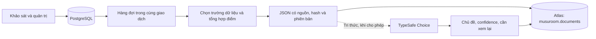

# Kho dữ liệu JSON và hỗ trợ phân loại Jev

Musuroom 1, mã nguồn **1.5.0**. PostgreSQL giữ dữ liệu gốc; Atlas lưu bản JSON để truy vấn và phân tích. Ngày 01.10.2026, database Supabase có 6 bài tri thức; đã đồng bộ và đọc kiểm chứng đủ 6 tài liệu trên Atlas, không còn công việc chờ. URI/key đã lưu riêng. JevAI vẫn báo credentials/model access rejected qua MCP chính thức (REST 502); chưa có inference Jev thành công. Bộ JSON cloud đã xuất cục bộ trong `data/exports/`, ngoài Git.

## Luồng xử lý



Mỗi tài nguyên có một công việc và số revision; nhận thêm hàng triệu phiếu không tạo hàng triệu bản sao phiếu trong Atlas. Điểm cảm quan được tổng hợp trong SQL. Worker xử lý mặc định 25 công việc/lần, chia batch 10; keyset pagination tránh tải toàn bộ dữ liệu vào RAM.

## Dữ liệu được đồng bộ

| Nhóm | Nội dung |
|---|---|
| `knowledge` | Bài tri thức, nguồn/citation, URL, giới hạn áp dụng và tags |
| `sensory` | Thống kê mỗi đợt/mã mẫu: số phiếu, mean, median, SD, phân bố và radar |
| `product` | Chỉ tiêu mẫu PUBLIC có minh chứng FINAL COA/REPORT, dinh dưỡng trên 100 g |

Không chọn tên, liên hệ, địa chỉ, mã đăng nhập, phiên, góp ý thô hoặc tệp hồ sơ riêng để đồng bộ. Mẫu chưa được công bố hoặc tài nguyên đã rút có `active=false`, `data=null`. Worker thay nội dung cũ bằng tombstone này để loại dữ liệu đã rút ở lần đồng bộ kế tiếp.

Envelope có `_id` ổn định, `source`, `type`, `resource_id`, `schema_version`, `source_revision`, `content_hash`, `app_version`, `projected_at`. `_id` kết hợp source với khóa tài nguyên. Schema MongoDB nằm tại [mongo-schema.json](../backend/services/mongo-schema.json); áp dụng khi tạo collection mới. Collection đã tồn tại cần người vận hành đối chiếu validator hiện có trước khi thay đổi.

Atlas dùng upsert và [pipeline cập nhật có điều kiện](https://www.mongodb.com/docs/manual/tutorial/update-documents-with-aggregation-pipeline/): revision cũ không ghi đè revision mới; `$literal` giữ nội dung JSON là dữ liệu. Chỉ xác nhận công việc SQL sau khi MongoDB ghi thành công. Lỗi giữa hai bước được thử lại. Lease SQL ngăn hai worker xử lý cùng lúc và hết hạn sau 5 phút khi tiến trình dừng bất thường. Mã lỗi lưu trong SQL không chứa URI hoặc thông tin xác thực.

Index cho `(source,type,resource_id)` là unique; `(source,type,_id)` phục vụ phân trang; `(source,jev.topic,jev.requires_review)` phục vụ phân loại. Đây là cơ chế đồng bộ tăng dần, chưa phải kết quả benchmark Big Data hoặc bảo đảm khôi phục sự cố.

## Thiết lập Atlas bên ngoài

1. Trong tài khoản Atlas của bạn, chọn cluster hiện có và vùng Singapore nếu phù hợp. Nếu chưa có cluster, tự chọn gói/ngân sách trước khi tạo.
2. Tạo database user riêng với quyền `readWrite` chỉ trên database `musuroom`. Hoàn tất mật khẩu trong Atlas; không sử dụng mật khẩu Supabase làm mật khẩu Atlas.
3. Trong Network Access, cho phép IP máy chạy script và IP egress Railway theo cấu hình/gói đang dùng. Không có IP egress ổn định thì đồng bộ từ máy có IP được cho phép và để `MONGO_ENABLED=false` trên Railway.
4. Trong **Connect > Drivers**, lấy SRV URI `mongodb+srv://...`, điền mật khẩu đã percent-encode. Trên máy này chạy **CAU_HINH_MONGODB.cmd**; helper lưu URI vào `data/cloud.env`, không in giá trị. Có thể điền trực tiếp trong Railway Variables khi vận hành từ máy khác.
5. Kiểm tra và đồng bộ một batch:

```powershell
$env:MUSUROOM_ENV_FILE='data/cloud.env'
pnpm data:sync
pnpm data:export
Remove-Item Env:MUSUROOM_ENV_FILE
```

Chạy lại `data:sync` để xử lý các batch còn chờ. Khi Railway đã có quyền mạng đến Atlas, chạy `pnpm cloud:deploy` để chuyển cấu hình và triển khai worker tự động. Kiểm tra pending/last sync trong cổng ADMIN, rồi kiểm tra collection `documents` trong Atlas. Không coi cờ `mongo_enabled=true` là xác nhận đã kết nối thành công.

`MONGO_SOURCE_ID=musuroom-production` dùng cho database cloud; `musuroom-local` dùng cho SQLite. Mỗi database chỉ vận hành một đích đồng bộ tại một thời điểm. Sau khi đổi source hoặc khôi phục database từ backup, dùng một source mới và `pnpm data:sync --rebuild` để đưa lại các tài nguyên vào hàng đợi. Lệnh không xóa tài liệu ở source cũ; người vận hành quyết định lưu giữ/thu hồi bản cũ trong Atlas.

## Jev cho tri thức

[Jev](https://docs.typesafe.ai/introduction) hỗ trợ quyết định có kiểu, ở đây dùng [Choice](https://docs.typesafe.ai/primitives/choice) để gợi ý chủ đề. Nó không huấn luyện lại mã nguồn hoặc tự xác nhận an toàn thực phẩm. Backend chỉ gọi JevAI Community: `POST https://www.jevai.org/api/v1/decisions`, key từ [/agent/keys](https://www.jevai.org/agent/keys), model cố định `typesafe-ai/jev`. Key này không gửi đến API TypeSafe trực tiếp hoặc provider khác. [REST/MCP JevAI](https://www.jevai.org/mcp) mô tả `jev_decide`; HTTP thành công dùng envelope `code=0`, `data` chứa kết quả có kiểu. Playground dùng để xem/thử yêu cầu.

Trong cổng ADMIN, chọn bài tri thức → **Xem yêu cầu Jev** → xem `state/questions` JSON. Nội dung gồm tiêu đề, tóm tắt, thân bài đã giới hạn và hạn chế áp dụng; không kèm dữ liệu cá nhân hoặc key. Khi đồng ý gửi, **Gợi ý chủ đề** trả nhãn thuộc rubric cố định, confidence và phân bố xác suất. Nhãn `other`, confidence dưới ngưỡng hoặc phản hồi không hợp lệ cần người vận hành xem lại. Confidence là tín hiệu của mô hình, chưa được hiệu chuẩn trên bộ đánh giá Musuroom.

Chạy **CAU_HINH_JEV.cmd** để lưu `JEV_API_KEY` từ JevAI /agent/keys phía server. `JEV_MODEL=typesafe-ai/jev`; backend không cho chọn model khác. `JEV_ENABLED=true` cho phép phân loại theo thao tác người dùng. Đồng bộ tự động chỉ gọi Jev khi thêm `MONGO_JEV_ENRICHMENT=true`; mặc định false để người vận hành quyết định phạm vi và chi phí. Chỉ bài tri thức được gửi trong worker; không tự đổi category, điểm cảm quan hoặc quyền truy cập.

Giới hạn: request 20.000 bytes, response 64 KiB, deadline toàn bộ lời gọi theo `AI_TIMEOUT_MS`, tối đa 2 lời gọi đồng thời mỗi evaluator. Chỉ retry một lần khi 429/529 và Retry-After tối đa 3 giây. Thiếu key, lỗi/timeout hoặc lựa chọn ngoài rubric trả `mode=local` theo luật từ khóa, confidence/probabilities=null và requires_review=true; các API khảo sát vẫn hoạt động.

| Biến | Mặc định | Mục đích |
|---|---|---|
| MONGO_ENABLED | false | Cấu hình worker Atlas |
| MONGODB_URI | Trống | URI xác thực, chỉ ở server |
| MONGODB_DATABASE | musuroom | Database Atlas |
| MONGO_SOURCE_ID | musuroom-production/cloud, musuroom-local/local | Phân biệt nguồn dữ liệu |
| MONGO_SYNC_BATCH_SIZE | 25 | 1–100 công việc/lần |
| MONGO_SYNC_INTERVAL_MS | 60000 | 10.000–3.600.000 ms |
| MONGO_JEV_ENRICHMENT | false | Cho phép phân loại tri thức trong worker |
| MONGO_JEV_MAX_PER_RUN | 10 | Tối đa 1–20 bài/lần khi enrichment được chọn |
| JEV_MIN_CONFIDENCE | 0.65 | Ngưỡng đề xuất cần xem lại, 0–1 |

Xuất toàn bộ dữ liệu theo dòng NDJSON bằng `pnpm data:export`. File được lưu ở `data/exports/`, đọc từng trang 100 công việc. Đây là projection tại thời điểm đọc từng bản ghi; cập nhật diễn ra trong lúc xuất có thể được bao gồm. Export này không thay thế backup PostgreSQL hoặc private Storage.

## Phân loại cục bộ khi Jev chưa đáp ứng

`backend/services/local-classifier.mjs` là bộ luật từ khóa tại server, không dùng provider khác. Chuẩn hóa tiếng Việt (gồm Đ/đ), khớp nguyên từ/cụm từ; hòa điểm hoặc không có từ khóa trả other. Kết quả luôn cần xem lại, không có độ tin cậy xác suất. Trên web, bỏ chọn ô gửi đến Jev để chỉ phân loại cục bộ; giao diện hiển thị nhãn và từ khóa khớp. Lỗi Jev cũng chuyển về bộ luật này.

Để thêm nhãn cục bộ vào JSON Atlas hiện có, chạy với môi trường cloud riêng: `pnpm data:sync --rebuild --local-classification`. Lệnh tăng revision và đồng bộ từng batch; không gọi Jev hoặc dịch vụ AI nào. Nhãn nằm trong metadata `jev` với mode=local/source=keyword_rules; không phải inference Jev. Worker mặc định chưa enrichment; cập nhật nội dung sẽ thay nhãn cũ, cần chạy lại phân loại.
